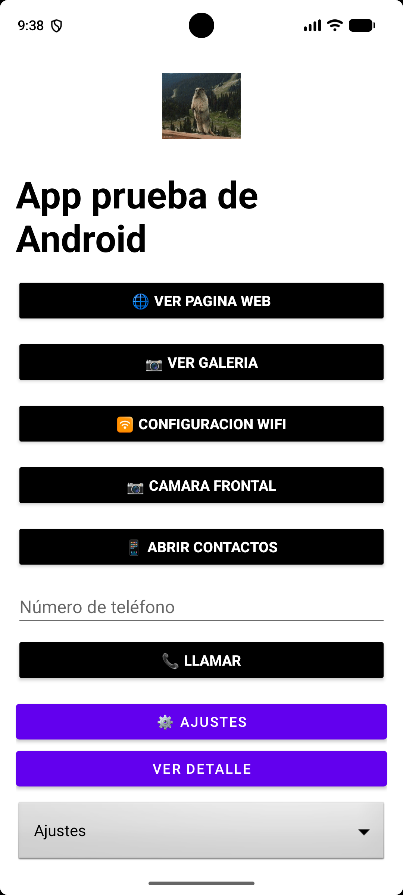
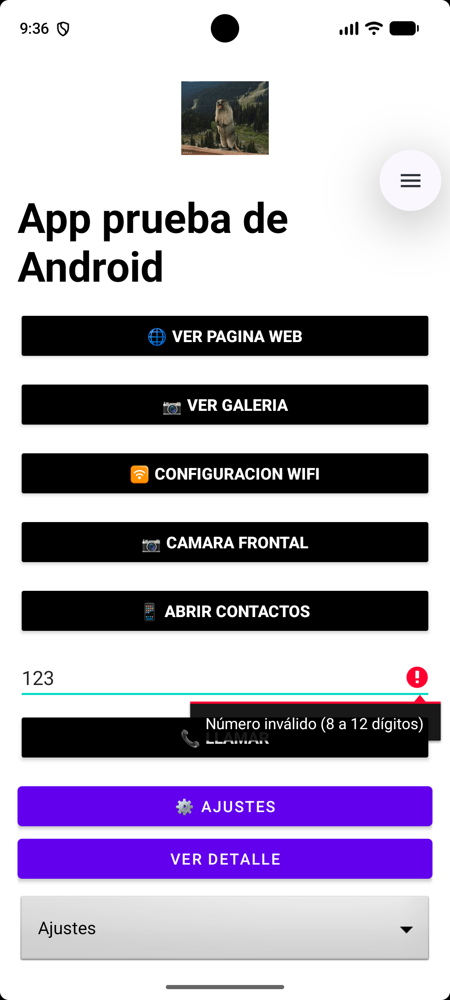
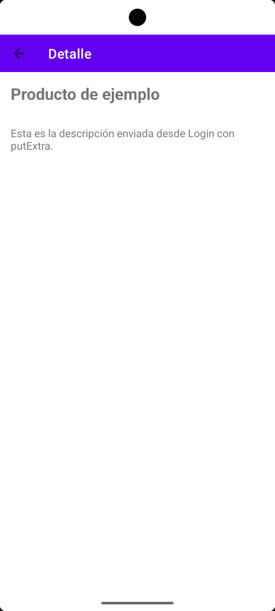
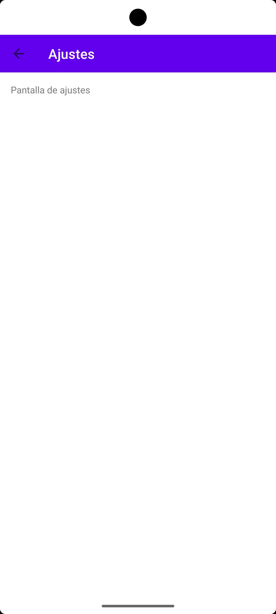

# 📱 AppPrueba - Prototipo 2: Intents en Android

Proyecto de **Programación Android** (Santo Tomás) que implementa intents **implícitos** y **explícitos**, validaciones y un GIF animado en la pantalla de login.

## 👥 Integrantes
- Martín Santibañez
- Samuel Bogarin

## 🛠️ Resumen técnico
| Dato | Valor |
|---|--|
| Lenguaje | Java |
| minSdk | 31 |
| targetSdk | 36 |
| Android Gradle Plugin (AGP) | 9.0.1 |
| Librería extra | Glide 4.16.0 (para mostrar el GIF) |
| Emulador de prueba | Pixel 7 |

## 🚀 Intents implementados

### 🌐 Implícitos (abren otras apps/sistemas)

| # | Intent | Acción | Cómo probarlo |
|---|---|---|---|
| 1 | Página web | `ACTION_VIEW` con `https://` | Pulsar **Ver pagina web**: abre el navegador |
| 2 | Galería | `ACTION_GET_CONTENT` con `image/*` | Pulsar **Ver galeria** y elegir una imagen: se muestra abajo en la app |
| 3 | Ajustes Wi-Fi | `Settings.ACTION_WIFI_SETTINGS` | Pulsar **Configuracion wifi**: abre los ajustes del sistema |
| 4 | Cámara frontal | `MediaStore.INTENT_ACTION_STILL_IMAGE_CAMERA` + extras | Pulsar **Camara frontal**: abre la cámara (depende del dispositivo) |
| 5 | Contactos | `ACTION_PICK` con `Phone.CONTENT_URI` | Pulsar **Abrir contactos** y elegir uno: aparece nombre y número en un Toast |
| 6 | Marcador telefónico | `ACTION_DIAL` con `tel:` | Escribir un número válido y pulsar **Llamar** |

### 🧭 Explícitos (navegan dentro del proyecto)

| # | Intent | Descripción | Cómo probarlo |
|---|---|---|---|
| 1 | `Login` → `DetalleActivity` | Envía título y descripción con `putExtra` | Pulsar **Ver detalle** |
| 2 | `Login` → `ConfigActivity` | Pantalla de ajustes con Toolbar y botón "Atrás" | Pulsar **Ajustes** |
| 3 | `Login` → Activity según opción | Intent dinámico elegido con un Spinner | Elegir una opción y pulsar **Ir a la opción elegida** |

## ✅ Validaciones
- **Teléfono (Login):** no puede estar vacío y debe tener entre 8 y 12 dígitos (admite `+` inicial). Si falla, se muestra el error en el campo y no se abre el marcador.
- **Extras (DetalleActivity):** si el título o la descripción llegan `null` o vacíos, se muestran valores por defecto y un aviso.
- **Intents implícitos:** se lanzan dentro de un `try/catch` para que la app no se cierre si no hay una app que los maneje.

## 📸 Capturas

| Login con GIF | Validación |
|---|---|
|  |  |

| DetalleActivity | ConfigActivity |
|---|---|
|  |  |

## ⚙️ Cómo compilar y ejecutar
1. Clonar el repositorio:
```
   git clone https://github.com/Martin21SM/AppPruebaBS.git
```
2. Abrir la carpeta en **Android